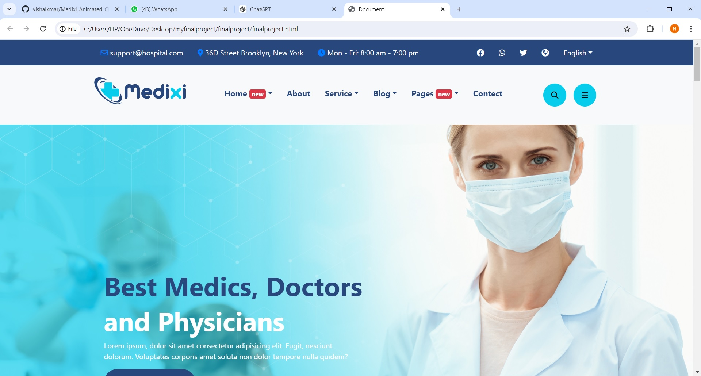
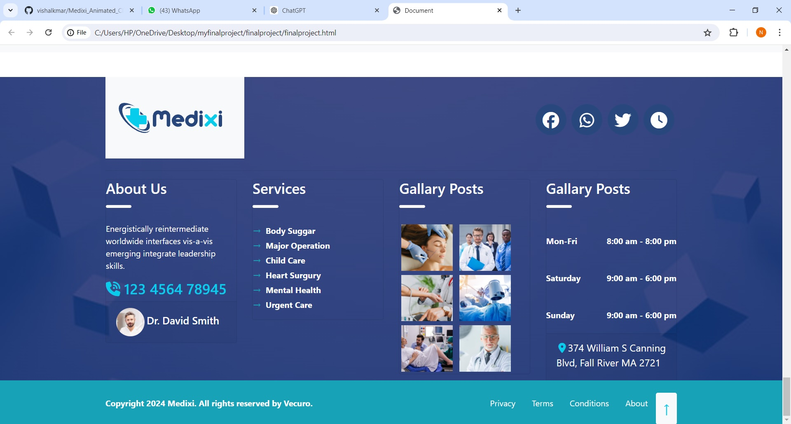

## <h1>Medical Website Landing Page</h1>
## Project Overview
This project is a responsive and animated landing page for a medical website. It showcases the use of modern web technologies such as HTML5, CSS3, jQuery, WOW.js, Bootstrap, and Animate.css to create a visually appealing and user-friendly interface.
## Header section

## Footer Section 

## <h1> Features</h1>
<ul>
  <li><b>Responsive Design:</b> Optimized for all screen sizes, ensuring a great user experience on desktops, tablets, and mobile devices.</li>
  <li><b>Animated Elements:</b> Smooth and engaging animations using WOW.js and Animate.css to enhance user interaction.</li>
  <li><b>Bootstrap Integration:</b> Utilizes Bootstrap for a responsive grid system and easy layout management.</li>
  <li><b>Modern UI/UX:</b> Clean and modern design with intuitive navigation and user interface..</li>
</ul>
<h1>Technologies Used</h1>
<ul>
  <li><b>HTML5:</b>For structuring the content and elements.</li>
  <li><b>CSS3: </b> For styling and layout..</li>
  <li><b>jQuery:</b>For DOM manipulation and interactive features.</li>
  <li><b>WOW.js:</b> For triggering animations on scroll..</li>
  <li><b>Bootstrap:</b> For responsive design and layout.</li>
  <li><b>Animate.css</b>For pre-defined CSS animations.</li>
</ul>

## Installation
1. Clone the repository
   git clone https://github.com/your-username/medical-website-landing-page.git

2. Navigate to the project directory:
   cd medical-website-landing-page
   
4. Open index.html in your preferred web browser or open the project folder in your code editor to start developing.

## Contributing
Feel free to contribute to this project by creating pull requests or submitting issues. Any contributions are welcome!

